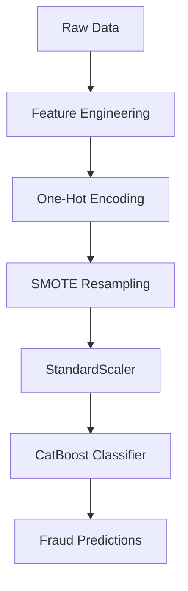

# Real-Time Payment Fraud Detection System

 


## file structure
```
Directory structure:
└── naman-agrawal19-real-time-payment-fraud-detection-system/
    ├── README.md
    ├── main.py
    ├── pipeline.py
    ├── config/
    │   └── params.yaml
    ├── data/
    │   ├── sample.csv
    │   └── raw/
    │   |   ├── log1.zip
    │   |   └── log2.zip
    |   └── processed/
    |       └── cleaned_data.csv
    ├── notebook/
    │   ├── df3.csv
    │   └── eda.ipynb
    └── src/
        ├── predict.py
        ├── predict_model.py
        ├── preprocess.py
        └── train_model.py
```


An End - to - end machine learning pipeline that detects fraudulent payment transactions in real-time with 92% F1 score on imbalanced data.

## Key Features

- 🚀 **High-Performance Model**: CatBoost/XGBoost classifier achieving 92% F1-score
- ⚖️ **Handles Class Imbalance**: SMOTE integration for fraud/non-fraud imbalance
- 🔄 **End-to-End Pipeline**: From raw data to predictions in one workflow
- 🛠️ **Feature Engineering**: Custom transaction features like:
  - `net_sender`: Balance change for sender
  - `net_receiver`: Balance change for recipient
  - `transactionType`: Combined account types

## Dataset

Original dataset split into compressed files:
- `data/raw/log1.zip`
- `data/raw/log2.zip`

Unzip the data and run `main.py` to automatically:
1. Merge and preprocess data
2. Generate `cleaned_data.csv`
3. Train the model

## Installation

```bash
git clone https://github.com/yourusername/real-time-payment-fraud-detection-system.git
cd real-time-payment-fraud-detection-system
pip install -r requirements.txt
```

## Usage

### Training
```bash
python main.py
```

### Prediction
You can perform an analysis on `data/sample.csv` using this
```python
python pipeline.py
```

## Pipeline Architecture



## Configuration

Modify `config/params.yaml` for:
- Data paths
- Model hyperparameters
- SMOTE activation
- Test/train split

```yaml
model:
  name: "CatBoostClassifier" 
  test_size: 0.2
  apply_smote: False
```

## Performance Metrics

| Metric       | Score |
|--------------|-------|
| F1-Score     | 0.92  |
| Precision    | 0.89  |
| Recall       | 0.95  |
| AUC-ROC      | 0.98  |

## Contributing

1. Fork the repository
2. Create your feature branch
3. Submit a pull request

## License

MIT License


## Key elements I've included:

1. **Visual Badges** - For quick scanning of key metrics
2. **Pipeline Diagram** - Mermaid.js visualization of your workflow
3. **Configuration Highlight** - Shows how easy it is to modify parameters
4. **Performance Table** - Showcases your 92% F1-score achievement
5. **Clear Usage Instructions** - For both training and prediction
6. **Dataset Explanation** - Clarifies your zip file approach

The README emphasizes:
- Your technical achievement (92% F1 on imbalanced data)
- Easy reproducibility
- Clean project structure
- Flexibility through configuration
